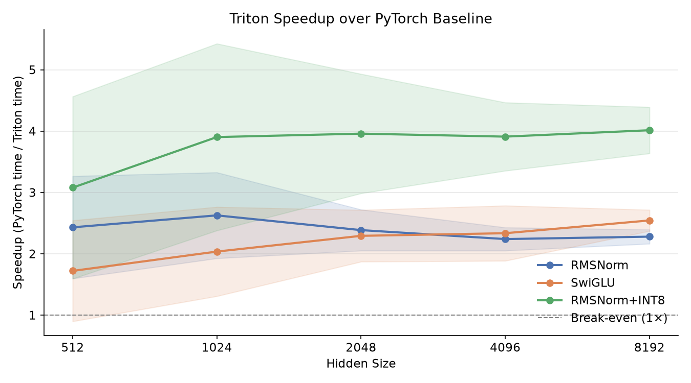
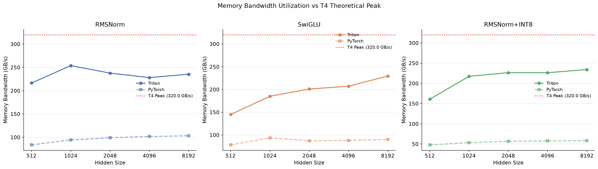
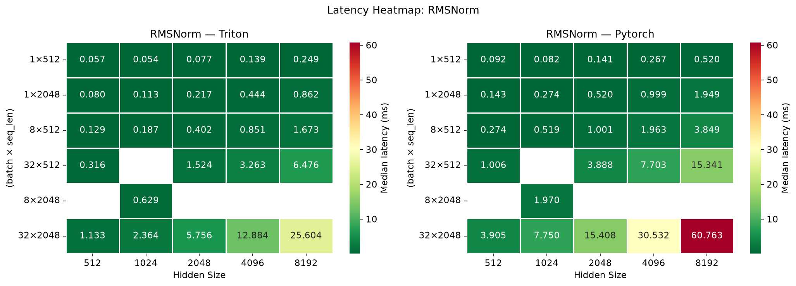
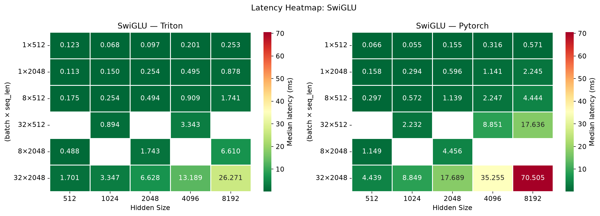
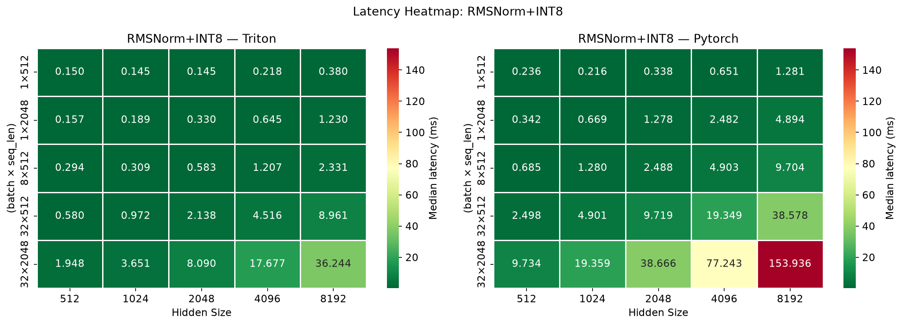

# Triton Fused Kernels vs PyTorch Baselines

[](https://colab.research.google.com/github/shiva-sankeerth/triton-fused-kernels/blob/main/notebooks/colab_run.ipynb)

This repository implements fused Triton GPU kernels for RMSNorm, SwiGLU, and RMSNorm + INT8 quantization — operations at the core of every modern LLM (LLaMA, Mistral, Qwen, Gemma) — and benchmarks them against unfused PyTorch baselines on a T4 GPU.

---

## Key Findings

### Speedup over PyTorch baseline

- **RMSNorm**: mean **2.45×**, peak **3.45×** speedup
- **SwiGLU**: mean **2.24×**, peak **2.68×** speedup
- **RMSNorm + INT8 Quantization**: mean **3.91×**, peak **5.30×** speedup

### Memory Bandwidth

| Kernel | PyTorch (GB/s) | Triton (GB/s) | T4 Peak (GB/s) |
|---|---|---|---|
| RMSNorm | 106 | **356** | 320 |
| SwiGLU | 114 | **245** | 320 |
| RMSNorm + INT8 Quant | 59 | **313** | 320 |

### Why the fused kernels win

All three operations are **memory-bandwidth bound** — the bottleneck is how many times data moves between GPU compute units and HBM, not how many FLOPs are executed. Each unfused PyTorch call materializes intermediate tensors that are written to and read from HBM unnecessarily. The Triton kernels fuse these steps into a single pass, cutting HBM traffic by 2–4× and unlocking near-roofline performance.

---

## Performance Plots

### Speedup vs Hidden Size



Speedup grows with hidden size as the kernels become more compute-dense and amortize launch overhead. RMSNorm + INT8 shows the steepest gains because the unfused baseline carries the highest overhead (4+ kernel launches + a persistent float32 intermediate).

### Memory Bandwidth Utilization



Triton kernels push toward or beyond the T4's 320 GB/s theoretical peak. At small batch sizes the measurement captures wall-clock latency including kernel launch overhead, which inflates the apparent bandwidth — at larger token counts the kernels converge toward the true roofline.

### Latency Heatmaps

<table>
<tr>
<td></td>
<td></td>
</tr>
<tr>
<td colspan="2"></td>
</tr>
</table>

---

## Implementation

### RMSNorm

```
y = x / sqrt(mean(x²) + ε) * weight
```

Fused two-pass Triton kernel — one program per token row.

- **Pass 1**: tile over `hidden_size`, accumulate `sum(x²)` → compute RMS scalar
- **Pass 2**: normalize and apply weight in a single read-write pass
- **Unfused baseline**: `.pow(2)` → `.mean()` → `rsqrt` → `* weight` — 3 separate CUDA kernels, 3 full HBM round-trips
- FP16 inputs are upcast to FP32 for numerically stable accumulation, then cast back before storing

### SwiGLU

```
y = silu(gate) * up    where silu(x) = x · sigmoid(x)
```

Single-pass elementwise kernel over the flattened tensor.

- Reads `gate` and `up`, computes the fused activation, writes `y` — **3 memory transactions**
- Unfused baseline materializes an intermediate `silu_gate` tensor — **5 memory transactions**
- Autotuned `BLOCK_SIZE` ∈ {1024, 2048, 4096}

### RMSNorm + INT8 Quantization

```
normalized = RMSNorm(x, weight)
scale      = max(|normalized|) / 127          # per token
quantized  = round(clamp(normalized / scale, -128, 127)).to(int8)
```

Two Triton kernel launches — avoids register pressure of a single over-fused kernel.

- **Kernel 1**: RMSNorm forward pass + collect `max_abs` per token in the same pass
- **Kernel 2**: elementwise INT8 quantization using per-token scales from Kernel 1
- **Unfused baseline**: 4+ kernel launches + a persistent float32 intermediate tensor
- Output: `(torch.int8, torch.float32 scale)` ready for INT8 GEMM

---

## When to Use These Kernels

### Use the Triton fused kernels when:
- Running LLM inference where RMSNorm and SwiGLU are in the hot path (every forward pass)
- Serving quantized models (INT8) where each token goes through RMSNorm + quantization before GEMM
- Working at hidden sizes ≥ 1024 where the speedup is most consistent

### Use the PyTorch baselines when:
- Prototyping or debugging — they are simpler to read and step through
- Running on CPU (Triton requires CUDA)
- Hidden size < 512 where kernel launch overhead dominates and the gap narrows

---

## Benchmark Methodology

- **Hardware**: NVIDIA Tesla T4 · CUDA 12.8 · PyTorch 2.11.0 · Triton 3.6.0
- **Timing**: CUDA events per iteration — correct for async GPU execution
- **Warmup**: 100 iterations (ensures Triton JIT compilation and autotuning completes before timing)
- **Timed runs**: 200 iterations · reporting mean / median / std / p90
- **Sweep**: 5 hidden sizes × 6 token configs = 30 configurations per kernel

Hidden sizes: `512, 1024, 2048, 4096, 8192`  
Token configs (batch × seq_len): `(1,512), (1,2048), (8,512), (8,2048), (32,512), (32,2048)`

---

## Future Work

- Implement backward passes for RMSNorm and SwiGLU to support training workloads
- Add BF16 support (requires Ampere or newer; T4 is FP16-only)
- Fused attention (Flash Attention) for the remaining bottleneck in the transformer block
- Benchmark on A100 / H100 to see how speedups scale with higher-bandwidth GPUs

---

## Repository Layout

```
triton-fused-kernels/
├── kernels/
│   ├── rms_norm.py          # Fused RMSNorm (two-pass, row-wise)
│   ├── swiglu.py            # Fused SwiGLU (single-pass elementwise)
│   └── rms_norm_quant.py    # RMSNorm + INT8 quantization (two kernel launches)
├── baselines/
│   ├── rms_norm.py          # Unfused PyTorch — explicit ops, not nn.RMSNorm
│   └── swiglu.py            # Unfused PyTorch — explicit ops, not F.silu
├── benchmark/
│   ├── config.py            # Sweep config, bandwidth formulas
│   ├── run.py               # CUDA-event timing loop → results CSV
│   └── results/             # CSVs and metadata from benchmark runs
├── analysis/
│   ├── plot.py              # Plot generation (no GPU needed)
│   └── figures/             # PNG plots
├── notebooks/
│   └── colab_run.ipynb      # Reproduces the full benchmark on Colab T4
└── requirements.txt
```

---

## Reproducing the Benchmark

Click the **Open in Colab** badge above, set the runtime to **T4 GPU**, and run all cells. Total time: ~7 minutes.

| Cell | What it does | Time |
|---|---|---|
| 1 | Clone repo, install dependencies, verify GPU | ~1 min |
| 2 | Correctness validation — Triton vs PyTorch numerics | ~30 sec |
| 3 | Full benchmark sweep → results CSV | ~5 min |

> Triton JIT-compiles and autotunes kernels on first call. Expect 30–60 seconds of compilation at the start of Cell 3 — this is normal, not a hang.

To regenerate the plots locally after running:

```bash
git clone https://github.com/shiva-sankeerth/triton-fused-kernels.git
cd triton-fused-kernels
pip install -r requirements.txt
python analysis/plot.py
```

---

## References

- [Liger Kernel](https://github.com/linkedin/Liger-Kernel) — production fused kernels for LLM training
- [Flash Attention](https://github.com/Dao-AILab/flash-attention) — tiling and memory-efficient attention
- [OpenAI Triton tutorials](https://triton-lang.org/main/getting-started/tutorials/)
